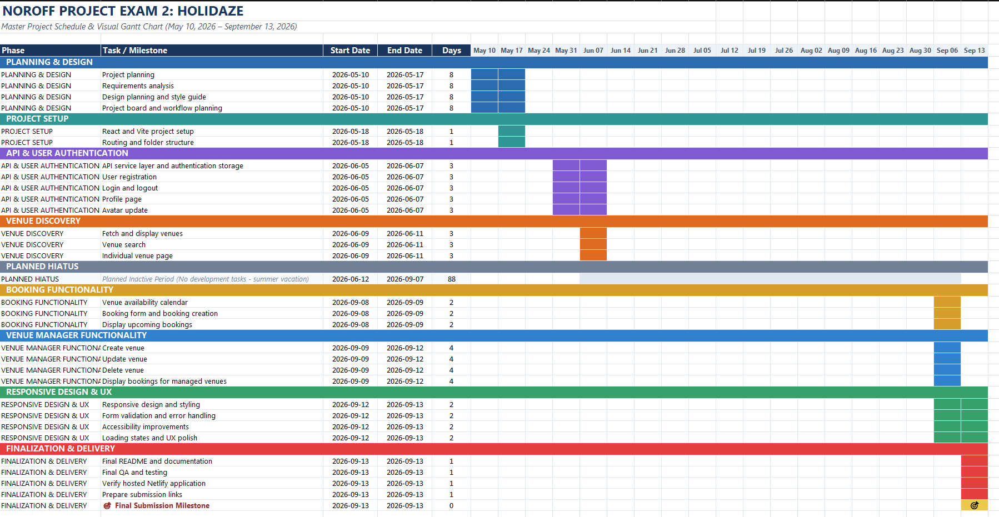

# Holidaze

Holidaze is an accommodation booking platform developed as part of **Project Exam 2** at **Noroff – School of Technology and Digital Media**.

The project demonstrates the practical application of front-end development skills acquired throughout the programme, including React, TypeScript, API integration, responsive design, accessibility, and project planning.

Users can browse and search venues, view availability, and make bookings. Registered venue managers can also create, update, and delete venues, as well as view bookings made at their venues.

---

## Built With 🛠️

- React
- TypeScript
- Vite
- CSS Modules
- Noroff Holidaze API
- Netlify

---

## Live Demo 🚀

👉 [View Holidaze on Netlify](https://raddishaipe2.netlify.app)

---

## Features ✨

- 🔎 **Browse & Search Venues** – Browse available venues and search for relevant stays
- 🏡 **Venue Details** – View venue information, images, amenities, location, rating, and pricing
- 📅 **Availability Calendar** – Check venue availability before booking
- 🧳 **Bookings** – Registered users can create bookings and view their upcoming stays
- 🔐 **Authentication** – Register, log in, and log out
- 👤 **Profile Management** – View profile information and update avatar
- 🏨 **Venue Management** – Venue managers can create, update, and delete their venues
- 📋 **Booking Management** – Venue managers can view bookings made at their venues
- 📱 **Responsive Design** – Responsive layouts for desktop, tablet, and mobile devices
- ♿ **Accessibility** – Semantic markup, keyboard support, focus states, and accessible status feedback
- ⚠️ **Validation & Error Handling** – User feedback for invalid input and failed API requests
- ⏳ **Loading & UX Feedback** – Loading, empty, success, and error states throughout the application

---

## Installation 💻

To run Holidaze locally:

1. Clone the repository:

   ```bash
   git clone https://github.com/RaddishAI/projectExam2.git
   ```

2. Navigate to the project directory:

   ```bash
   cd projectExam2
   ```

3. Install dependencies:

   ```bash
   npm install
   ```

4. Create a `.env` file in the root of the project.

5. Add a valid Noroff API key to the environment variable used by the application:

   ```env
   VITE_NOROFF_API_KEY=<your Noroff API key>
   ```

   Each developer running the project locally must provide their own valid Noroff API key. The API key is not included in the repository.

6. Start the development server:

   ```bash
   npm run dev
   ```

The application will then be available locally through the URL provided by Vite.

---

## Usage 📖

### Visitors

Visitors can:

- Browse available venues
- Search for venues
- View individual venue details
- View venue availability

### Registered Users

Registered users can additionally:

- Log in and log out
- View their profile
- Update their avatar
- Create bookings
- View upcoming bookings

### Venue Managers

Venue manager accounts can additionally:

- Create new venues
- Update their own venues
- Delete their own venues
- View bookings made at their venues

---

## Project Planning 📊

The project was managed using a **GitHub Projects Kanban board** and a feature-based Git workflow.

Development tasks were organised as individual GitHub issues and implemented on dedicated feature branches. Completed features were reviewed through pull requests before being merged into `main`.

### Gantt Chart

The Gantt chart provides an overview of the project timeline and development phases.



---

## Requirements & Links 📌

- **Gantt Chart:** [View Gantt chart](src/assets/gantt-chart.png)
- **Design Prototype:** [View in Figma](https://www.figma.com/design/lrcOmHFyhrn2rtkLra2NP3/Project-Exam-2---Holidaze?node-id=0-1&m=dev&t=XRz9YNlG1mQRiayY-1)
- **Style Guide:** [View in Figma](https://www.figma.com/design/lrcOmHFyhrn2rtkLra2NP3/Project-Exam-2---Holidaze?node-id=0-1&m=dev&t=XRz9YNlG1mQRiayY-1)
- **Kanban Board:** [GitHub Projects](https://github.com/users/RaddishAI/projects/2/views/1)
- **GitHub Repository:** [RaddishAI/projectExam2](https://github.com/RaddishAI/projectExam2)
- **Hosted Demo:** [Holidaze on Netlify](https://raddishaipe2.netlify.app)

---

## AI Assistance 🤖

AI tools were used throughout the project as supporting tools for technical sparring, troubleshooting, documentation, and design discussions.

- **ChatGPT** – Used for technical sparring, debugging, README assistance, and feedback on the colour palette and visual design profile.
- **Claude** – Used for technical sparring, debugging, and assistance with writing and improving JSDoc documentation.
- **Gemini** – Used to assist with structuring and creating the project Gantt chart.

The AI tools were used as part of the development and learning process to discuss approaches, identify issues, and improve documentation. The implementation and final project decisions remained my own.

---

## Contact Me 📬

- [LinkedIn](https://www.linkedin.com/in/petter-r%C3%B8nning-80602613a/)
- [Email](mailto:petter.arbeid@gmail.com)

---

## Credits 🎉

Holidaze was developed by **Petter Rønning** as part of **Project Exam 2** at **Noroff – School of Technology and Digital Media**.
